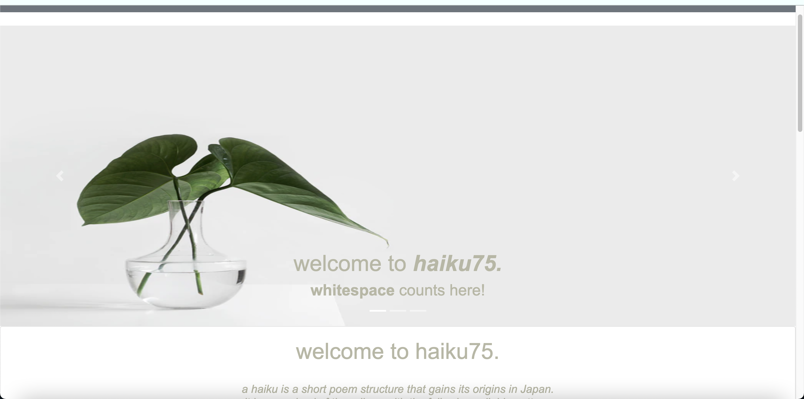
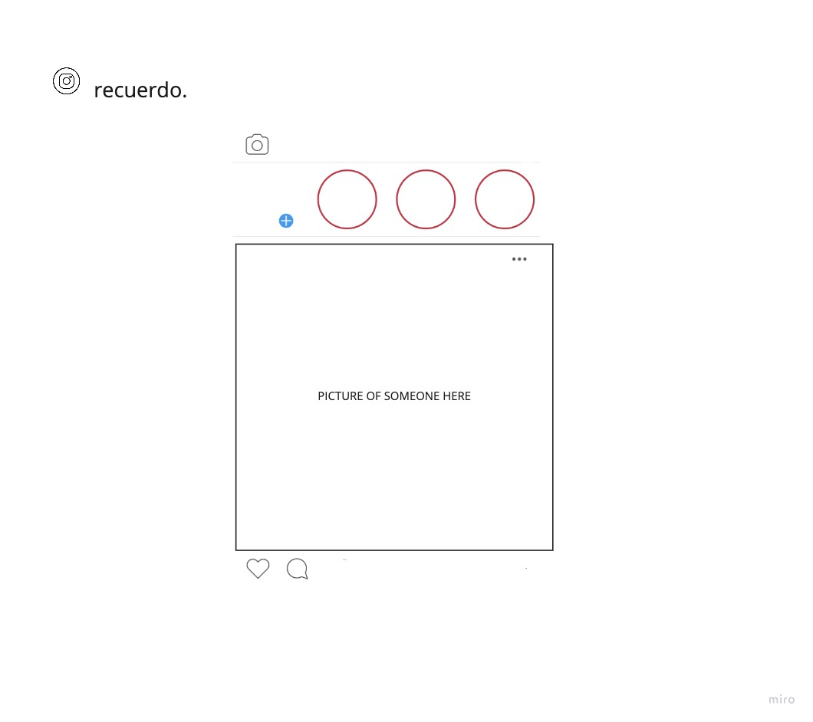

# haiku75.
welcome to haiku75. a place where you can write haikus with a _challenge_. if you're already a fan of the short poetry type - you'll especially love the challenge of only getting 75 total max characters to compose a haiku - and yes, that includes the title too. enjoy 😈.

## Useful Links

- (https://github.com/cesarinag/recuerdo_server "Backend Repo")
- (https://recuerdo-server.herokuapp.com/ "Deployed Backend")
- (https://cesarinag.github.io/recuerdo_client/ "Deployed Client")

## Screenshot of haiku75.

### Planning Process and Problem-Solving Strategy
Originally, my capstone project was going to be an Instagram clone. I created wireframes (shown below) for an Instagram clone that was to be called 'recuerdo', hence the name of the project and repositories. I quickly became uninterested in an Instagram clone and felt like a Twitter clone was far more my cup of tea. But I lost interest for that as well. I write poetry and have for many years (shameless upcoming book plug here) and I felt much more inclined to create something that resonated with my interests. I love Twitter - but I felt more inclined towards this niche. The real issue was figuring out how many characters were enough characters to still be a challenge but I'll delve more into that on my backend repo.

## User
- email
- hashedPassword
- token

## Haiku
- title
- five syllables
- seven syllables
- five syllables

## User Stories
- Version 1
As a user, I want to sign in
As a user, I want to sign in
as a user, I want to sign out
as a user, I want to change my password
as a user, I want to create a haiku
as a user, I want to view my haikus
as a user, I want to delete haikus I don't like
as a user, I want to update haikus I created

## Unsolved Problems for Future Iterations
- Translate this app to Spanish so my mom can use it
- Create a haiku community and make this more like a forum

## Technologies Used
* HTML/SCSS
* JavaScript
* Bootstrap
* Axios
* React/JSX

## Wireframe

